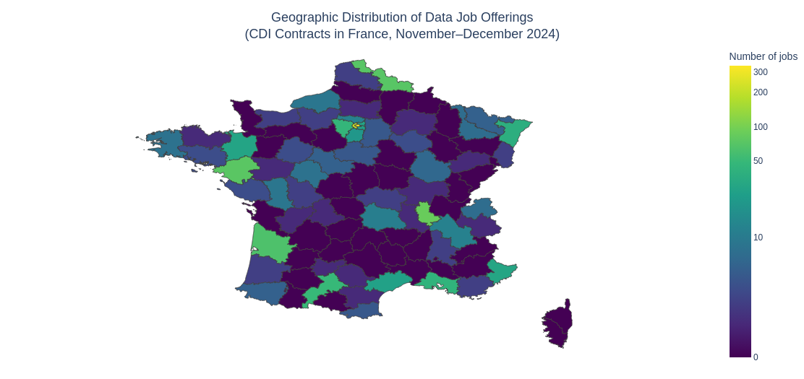
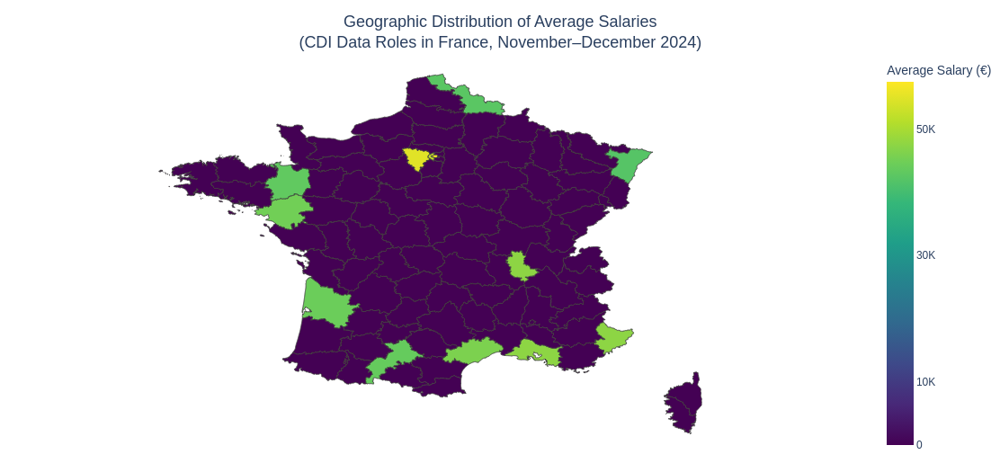
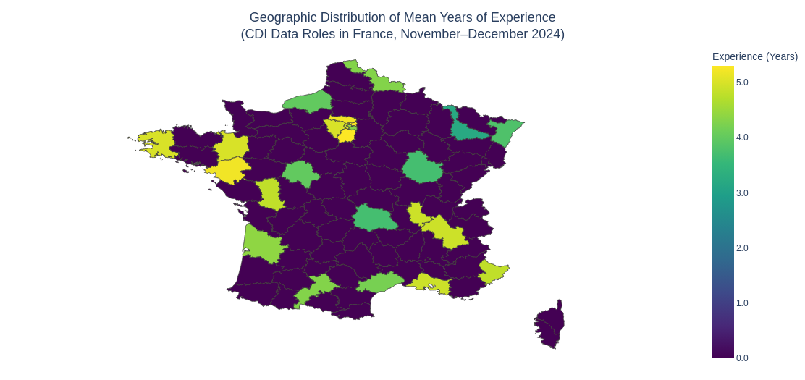
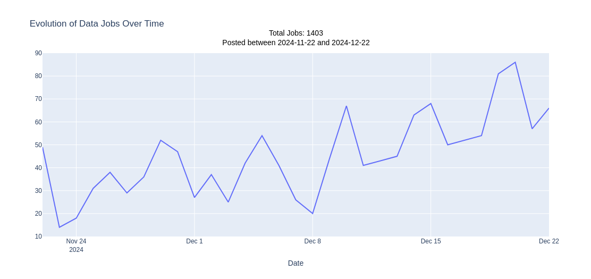
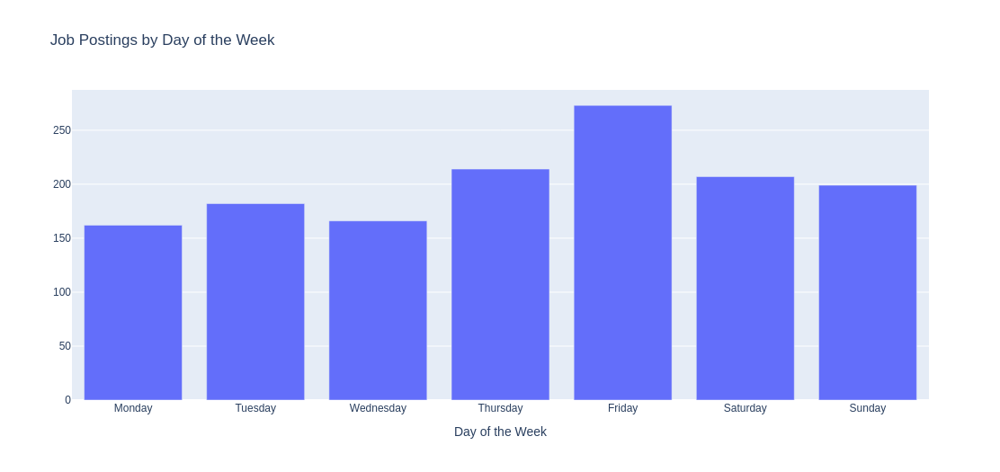
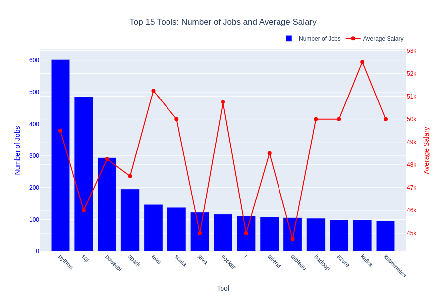
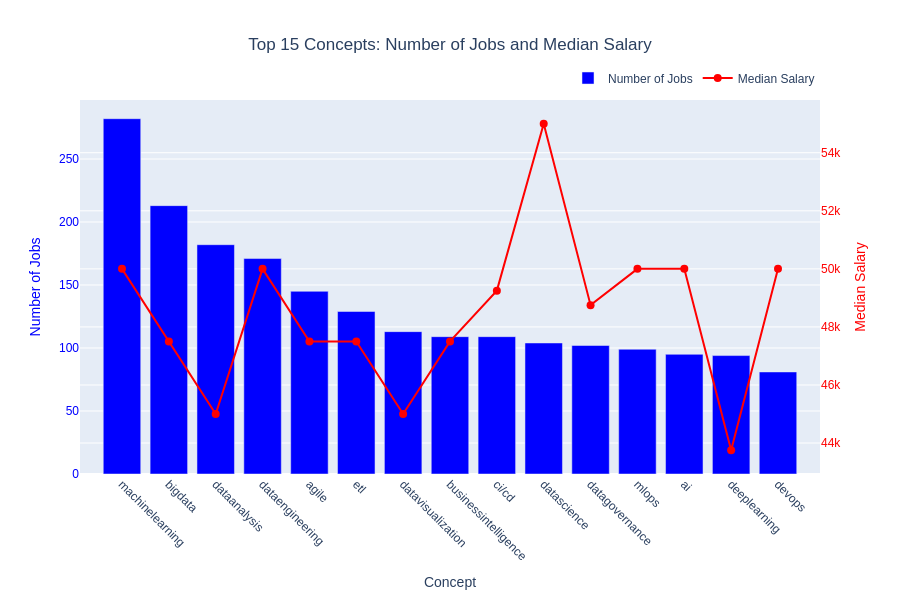
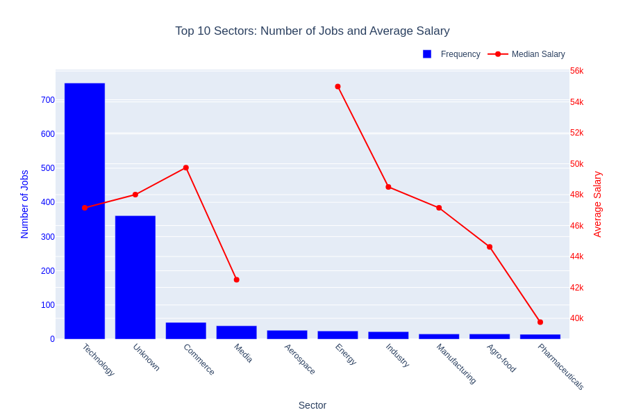

# Data Jobs Market Analysis in France

## Table of Contents
1. [Introduction](#introduction)
2. [Objectives](#objectives)
3. [Data Collection and Processing](#data-collection-and-processing)
   - [Web Scraping](#web-scraping)
   - [Dataset Creation](#dataset-creation)
   - [Data Cleaning](#data-cleaning)
4. [Data Description](#data-description)
5. [Analysis](#analysis)
   - [Geographic Analysis](#geographic-analysis)
   - [Temporal Analysis](#temporal-analysis)
   - [Roles Analysis](#roles-analysis)
   - [Tools and Technologies Analysis](#tools-and-technologies-analysis)
   - [Sector Analysis](#sector-analysis)
6. [Closing Remarks](#closing-remarks)

---

## Introduction

This project analyzes the data job market in France using ~1,500 job postings scraped from HelloWork, covering the period from November 22, 2024, to December 22, 2024. The goal is to provide actionable insights into job distribution, required skills, and salary trends.

HelloWork is a prominent job board in France, attracting approximately 4 million unique visitors per month and offering over 900,000 job vacancies. In November 2024, it ranked as the third most visited jobs and employment website in France, following France Travail (formerly Pôle Emploi) and Indeed ([source](https://www.similarweb.com/top-websites/france/jobs-and-career/jobs-and-employment/?utm_source=chatgpt.com)). This platform's popularity and extensive listings make it a valuable resource for analyzing trends in the job market.

**Tools Used:**
- **Python:** For scripting and data processing.
- **OpenAI API:** To extract structured data from job descriptions.
- **Pydantic:** For data validation and schema enforcement.
- **Selenium:** For web scraping and automating job search navigation.
- **Jupyter:** For interactive analysis and visualization.
- **Pandas:** For data manipulation and analysis.
- **GeoPandas:** For geographic visualizations and spatial data analysis.

---

## Objectives
- Understand the geographic and temporal distribution of data jobs.
- Identify high-demand tools, concepts, and roles.
- Explore salary trends by role, sector, and experience level.
- Provide recommendations for job seekers and recruiters.

---

## Data Collection and Processing

### Web Scraping
Data was scraped using **Selenium** and **BeautifulSoup**. The scraping process targeted key data fields like job titles, company names, salaries, locations, and contract types.

### Dataset Creation
**OpenAI's API** was used to extract structured data from unstructured job descriptions. The structured data was validated using **Pydantic**.

### Data Cleaning
Key steps included:
- Filtering out irrelevant data (e.g., freelance jobs).
- Standardizing sectors using predefined mappings.
- Filling missing salary values when possible.

---
## Data Description

The dataset used in this project consists of job postings scraped from HelloWork, covering the period from November 22, 2024, to December 22, 2024. Below is a summary of the dataset's structure and key fields:

### Dataset Overview
| Column              | Description                                                                 |
|---------------------|-----------------------------------------------------------------------------|
| `index`             | Unique identifier for each job posting.                                    |
| `title`             | Job title as listed in the posting.                                        |
| `company`           | Name of the company offering the job.                                      |
| `location`          | City where the job is based.                                               |
| `department`        | Department number (e.g., 69 for Rhône).                                    |
| `contract_type`     | Type of contract (e.g., CDI, Freelance).                                   |
| `remote`            | Indicates if the job is Remote, Hybrid, or Onsite.                        |
| `sector`            | Industry sector of the job (e.g., Technology, Commerce).                  |
| `publication_date`  | Date the job posting was published.                                        |
| `experience_years`  | Number of years of experience required for the role.                      |
| `education_level`   | Education level required (e.g., 5.0 for Bac+5).                           |
| `salaire_min`       | Minimum salary offered for the job (if specified).                        |
| `salaire_max`       | Maximum salary offered for the job (if specified).                        |
| `annual`            | Indicates if the salary is annual (`true` or `false`).                    |
| `tools`             | List of tools or technologies required for the role.                      |
| `concepts`          | List of key concepts mentioned in the job posting.                        |
| `job_url`           | URL to the original job posting.                                           |
| `avg_salary`        | Average of `salaire_min` and `salaire_max` (if both are available).        |
| `roles`             | List of roles associated with the job (e.g., Data Analyst, Data Engineer).|
| `day_of_week`       | Day of the week when the job was posted.                                   |
| `tools_list`        | Flattened list of tools extracted from the `tools` column.                |

### Example Data
| index | title                  | company       | location | department | contract_type | remote  | sector      | publication_date | experience_years | education_level | salaire_min | salaire_max | annual | tools                                               | concepts                        | job_url                                               | avg_salary | roles              | day_of_week | tools_list                                       |
|-------|------------------------|---------------|----------|------------|----------------|---------|-------------|------------------|------------------|-----------------|-------------|-------------|--------|----------------------------------------------------|--------------------------------|-------------------------------------------------------|------------|--------------------|-------------|---------------------------------------------------|
| 816   | Tech Lead Data Analyst | JEMS Group    | Lyon     | 69         | CDI            | Hybrid  | Technology  | 2024-12-14       | NaN              | 5.0             | 36800.0     | 57500.0     | true   | ['SQL', 'MS Office', 'Outils BI', 'Data Science'] | NaN                            | [Link](https://www.hellowork.com/fr-fr/emplois/59492176.html) | 47150.0    | ['Data Analyst']  | Saturday    | SQL,MS Office,Outils BI,Data Science             |
| 787   | Expert Fonctionnel Data| Groupe SEB    | Écully   | 69         | CDI            | Hybrid  | Commerce    | 2024-12-15       | 5.0              | 5.0             | 50000.0     | 60000.0     | true   | ['SAP BW', 'Qlik Sense']                           | ['Data Management', 'Agile']   | [Link](https://www.hellowork.com/fr-fr/emplois/58288503.html) | 55000.0    | ['Data Analyst']  | Sunday      | SAP BW,Qlik Sense                               |
| 559   | Développeur Big Data   | SII Ouest     | Le Mans  | 72         | CDI            | Hybrid  | Technology  | 2024-11-24       | 3.0              | 5.0             | 35000.0     | 45000.0     | true   | ['Hadoop', 'Spark', 'Cloudera', 'Hive']           | ['Big Data', 'SQL', 'Java']    | [Link](https://www.hellowork.com/fr-fr/emplois/50709968.html) | 40000.0    | ['Data Engineer'] | Sunday      | Hadoop,Spark,Cloudera,Hive                      |

This structured data enables targeted analysis for actionable insights.

---
## Analysis
## Geographic Analysis

### Context and Objectives
This analysis examines the geographic distribution of data job opportunities in France, focusing on job density, average salaries, and required years of experience. The aim is to uncover regional trends that can inform decisions for job seekers and recruiters.

### Key Findings
1. **Job Density**: The majority of data job postings are concentrated in metropolitan regions such as Île-de-France, Rhône-Alpes, and Provence-Alpes-Côte d'Azur.
2. **Salaries**: Île-de-France leads with the highest average salaries, often surpassing €55,000 annually for key roles.
3. **Experience Requirements**: The most experienced candidates are typically required in regions like Île-de-France and Rhône-Alpes, with average requirements ranging from 4 to 5 years.

### Visualizations
  
*This map illustrates the density of CDI data job postings across French departments.*

  
*This map highlights the average salaries offered in data job postings by department.*

  
*This map shows the average years of experience required for data roles in each department.*

### Discussion
The data highlights significant regional disparities in job availability, salaries, and experience requirements. Metropolitan areas, particularly Île-de-France, dominate in terms of both job volume and compensation, reflecting their role as economic hubs. Meanwhile, other regions may offer fewer opportunities but still demand competitive experience levels. These insights underline the importance of geographic considerations for both job seekers and employers when navigating the data job market in France.

---

## Temporal Analysis

### Context and Objectives
This analysis examines the temporal patterns in data job postings during the period from November 22, 2024, to December 22, 2024. The objective is to uncover trends over time and identify the days with the highest activity to guide job seekers and recruiters.

### Key Findings
1. **Daily Trends**: Job postings exhibit a consistent rise and fall, with noticeable peaks around the second and third weeks of December.
2. **Weekly Patterns**: Friday sees the highest volume of job postings, while activity is relatively lower on weekends.

### Visualizations
  
*This line chart shows the number of job postings per day, highlighting temporal variations over the analyzed period.*

  
*This bar chart displays the distribution of job postings across the days of the week.*

### Discussion
The analysis indicates that Fridays are the most active days for job postings, potentially reflecting employer behavior before the weekend. The daily trend suggests a steady flow of opportunities, with increased activity as the month progresses. For job seekers, monitoring job boards closely on Thursdays and Fridays may maximize their chances of finding new opportunities. Employers might consider timing their postings to align with these peaks to attract more candidates.

---
## Roles Analysis

### Context and Objectives
This analysis categorizes data job postings into specific roles to understand their distribution, salary trends, required experience, and most in-demand tools. The objective is to identify key insights for job seekers and recruiters regarding the most prevalent roles and their associated requirements.

### Key Findings
1. **Most Common Role**: Data Engineer is the most in-demand role, with significantly higher job counts compared to others.
2. **Salaries**: While Data Governance & Quality roles offer the highest average salaries, Project Manager (Data) and Data Scientist roles follow closely.
3. **Experience Requirements**: Project Manager (Data) roles require the most experience at 5.3 years, reflecting their strategic and leadership focus.
4. **Tools**: Python and SQL are consistently the top tools demanded across all roles, with Power BI and Spark appearing in role-specific contexts.

### Table
| Role                       | Number of Jobs | Average Salary (€) | Average Experience (Years) | Top 3 In-Demand Tools     |
|----------------------------|----------------|---------------------|----------------------------|---------------------------|
| Data Engineer              | 555            | 47,500              | 4.9                        | Python, SQL, Spark        |
| Data Analyst               | 471            | 45,000              | 4.6                        | SQL, Power BI, Python     |
| Data Scientist             | 329            | 48,750              | 4.6                        | Python, SQL, Docker       |
| Project Manager (Data)     | 258            | 50,000              | 5.3                        | SQL, Python, Power BI     |
| Data Governance & Quality  | 96             | 55,000              | 4.7                        | Power BI, SQL, Python     |

### Discussion
Data Engineer roles dominate the market, highlighting the demand for skills in data infrastructure and pipeline management. Despite having fewer job openings, Data Governance & Quality roles offer the highest salaries, emphasizing their strategic value to organizations. Across all roles, Python and SQL remain indispensable, further underlining their centrality in the data domain. For job seekers, focusing on these skills will maximize employability, while recruiters should clearly define the toolsets required for each role to attract suitable candidates.

---

## Tools and Technologies Analysis

### Context and Objectives
This section explores the tools and concepts most frequently mentioned in job postings. The goal is to identify the key technical skills and knowledge areas driving demand in the data job market, as well as their associated salaries.

### Key Findings
1. **Top Tools**: Python and SQL dominate the market, appearing in the majority of job postings. Power BI and Spark follow as additional highly sought-after tools.
2. **Top Concepts**: Machine learning, big data, and data analysis are the most frequently mentioned concepts, highlighting the focus on advanced data processing and AI applications.
3. **Salary Trends**: Tools like Scala and Kubernetes command higher salaries, reflecting their specialized nature. Similarly, concepts like CICD and data governance are associated with higher median salaries.

### Visualizations
  
*This bar and line chart displays the top 15 tools, their demand in terms of job postings, and the corresponding average salaries.*

  
*This bar and line chart illustrates the top 15 concepts, their demand, and their median salaries.*

### Discussion
Python and SQL remain foundational skills for data roles, underscoring their importance across a wide range of job categories. Power BI's presence highlights the growing need for business intelligence skills. Concepts such as machine learning and big data reflect the industry's focus on advanced analytics, while CICD and data governance suggest an emphasis on streamlined workflows and data quality. These insights are valuable for both professionals looking to prioritize skill development and organizations aiming to align their hiring strategies with market trends.

---
## Sector Analysis

### Context and Objectives
This analysis highlights the distribution of data job postings across various industry sectors, focusing on job frequency and average salaries. The goal is to identify which sectors offer the most opportunities and the highest compensation.

### Key Findings
1. **Top Sector**: The Technology sector leads with over 700 job postings, far surpassing other sectors.
2. **Salaries**: Energy and Aerospace sectors offer the highest average salaries, exceeding €54,000 annually.
3. **Other Sectors**: Sectors like Commerce, Media, and Manufacturing have lower job volumes but still present opportunities for specialized roles.
4. **Unknown Sector**: The "Unknown" category, representing over 300 job postings, refers to roles where the sector was not explicitly mentioned in the job description or was unrecognized by the generative AI (GPT-4o Mini) used for analysis.
5. **Aerospace Sector**: Despite having around 30 job postings, none of these roles disclosed salary information, indicating a gap in transparency.

### Visualization
  
*This chart illustrates the top 10 sectors by job frequency and their corresponding average salaries.*

### Discussion
The dominance of the Technology sector reflects the ongoing demand for tech-driven roles in data. High salaries in the Energy and Aerospace sectors suggest a premium on niche expertise and strategic data applications. However, the lack of salary information in the Aerospace sector and the significant volume of "Unknown" categorized roles highlight areas for improvement in job posting clarity and transparency. These trends emphasize the varied landscape of data roles across industries, offering a mix of opportunities for professionals with diverse skill sets.

---
## Closing Remarks

This project offers a feeling of the data job market in France, highlighting both its strengths and areas for improvement. From analyzing ~1,500 job postings, clear trends emerge that reflect the evolving nature of the industry.

The Technology sector dominates, confirming its central role in data-driven initiatives. Tools like Python and SQL remain staples, serving as prerequisites for the majority of roles across sectors and functions. However, there’s room for nuance—niche tools like Spark or Kubernetes are valued in more specialized positions, and concepts like machine learning and data governance continue to shape expectations.

Geographically, Île-de-France stands out, not just for its job density but also for its higher-than-average salaries. Yet, other regions like Rhône-Alpes show potential, with competitive opportunities for experienced professionals. The temporal analysis adds another layer of insight, showing that Fridays are particularly active for job postings—a pattern that job seekers and recruiters can leverage.

Roles like Data Engineer, Data Analyst, and Data Scientist take center stage, but the demands and rewards vary. For instance, while Data Engineers are in highest demand, Data Governance & Quality roles offer the best salaries, reflecting their strategic importance to organizations. However, junior positions (less than two years of experience) are quite rare, emphasizing a preference for mid-to-senior-level candidates across most roles.

The analysis also underscores some challenges. Salary transparency is lacking in many postings, especially in high-paying sectors like Aerospace. The "Unknown" sector category further illustrates the inconsistencies in how jobs are classified, which can make market navigation more difficult for both candidates and recruiters.

In summary, the data job market in France offers promising opportunities, but navigating it effectively requires attention to detail—whether it’s mastering in-demand tools, understanding regional dynamics, or timing applications strategically. This report provides actionable insights to help job seekers target their efforts and recruiters refine their strategies in this competitive landscape.

